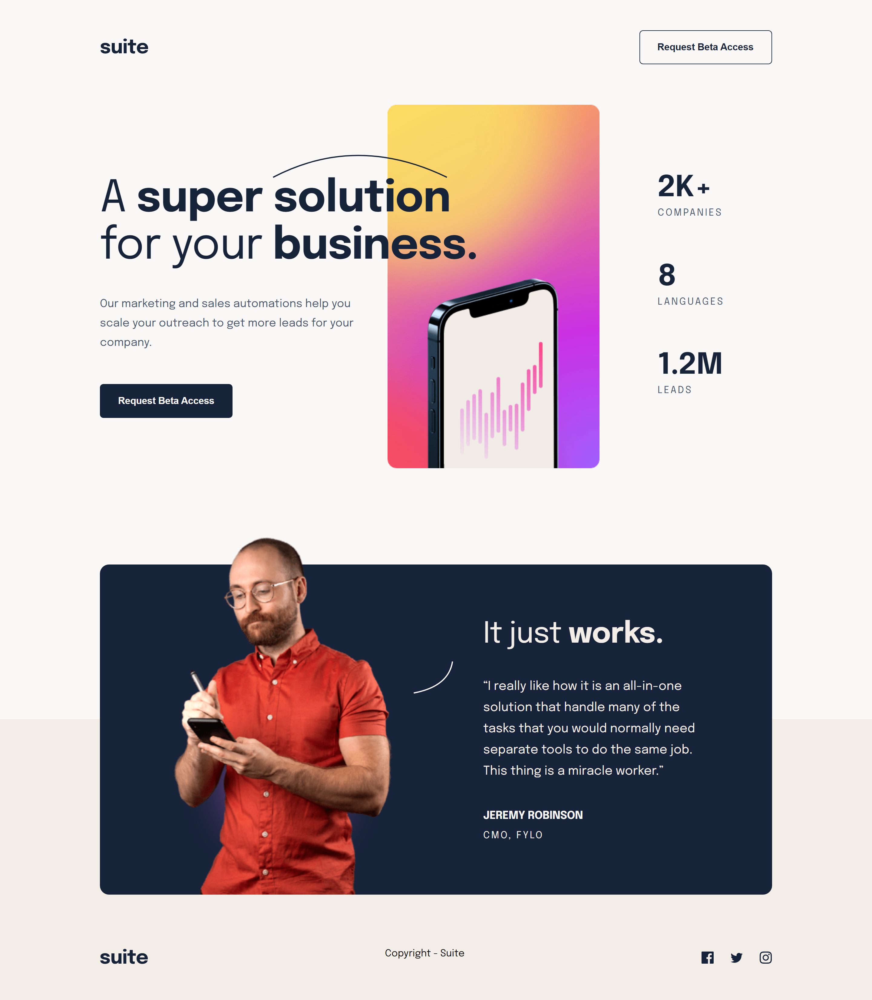

# Frontend Mentor - Suite landing page solution

This is my own solution to the [Suite landing page challenge on Frontend Mentor](https://www.frontendmentor.io/challenges/suite-landing-page-tj_eaU-Ra). Frontend Mentor challenges help you improve your coding skills by building realistic projects.

## Table of contents

- [Overview](#overview)
  - [The challenge](#the-challenge)
  - [Screenshot](#screenshot)
  - [Links](#links)
- [My process](#my-process)
  - [Built with](#built-with)
- [Author](#author)

## Overview

## The challenge

Users should be able to:

- View the optimal layout depending on their device's screen size
- See hover states for interactive elements

### Screenshot

### Links

- Live Site URL: [Suite Landing Page](https://testerium-suite-landing-page.netlify.app/)

## My process

The entire project took me 7.5h to complete, including responsive web design for desktop, tablet and mobile views. For the first time I used @mixin for buttons in SCSS. This is a useful solution, reducing the amount of code in SCSS. The project did not cause me any difficulties.

### Built with

- HTML
- CSS 
- SCSS 
- Flexbox
- Grid

## Author

- Frontend Mentor - [@testerium](https://www.frontendmentor.io/profile/testerium)